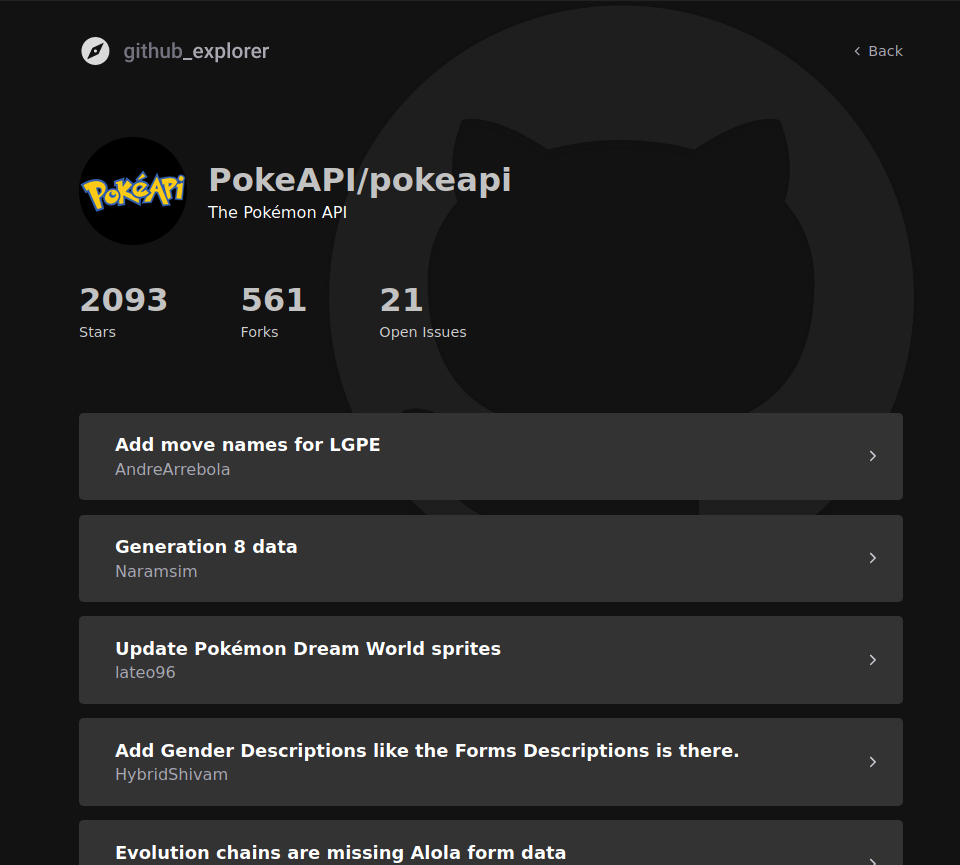

<h1 align="center">
   github-explorer
</h1>

<p align="center" >
  <a href="#framed_picture-preview"> 🖼️ Preview</a> |
  <a href="#construction-project"> 🚧 Project</a> |
  <a href="#rocket-technologies"> 🚀 Technologies</a> |
  <a href="#zap-getting-started"> ⚡ Getting started</a>
</p>


## :framed_picture: Preview




## :construction: Project

GitHub Explorer is an app developed with React + TypeScript, that uses the [GitHub API](https://docs.github.com/en/rest) to retrieve repositories and display their information.


## :rocket: Technologies

This app feature the following techs:

- [Typescript](https://www.typescriptlang.org/)
- [ReactJS](https://github.com/facebook/react)

## :zap: Getting started
```sh
$ git clone git@github.com:pedrozocatelli/github-explorer.git
$ cd github-explorer
$ yarn dev
```
